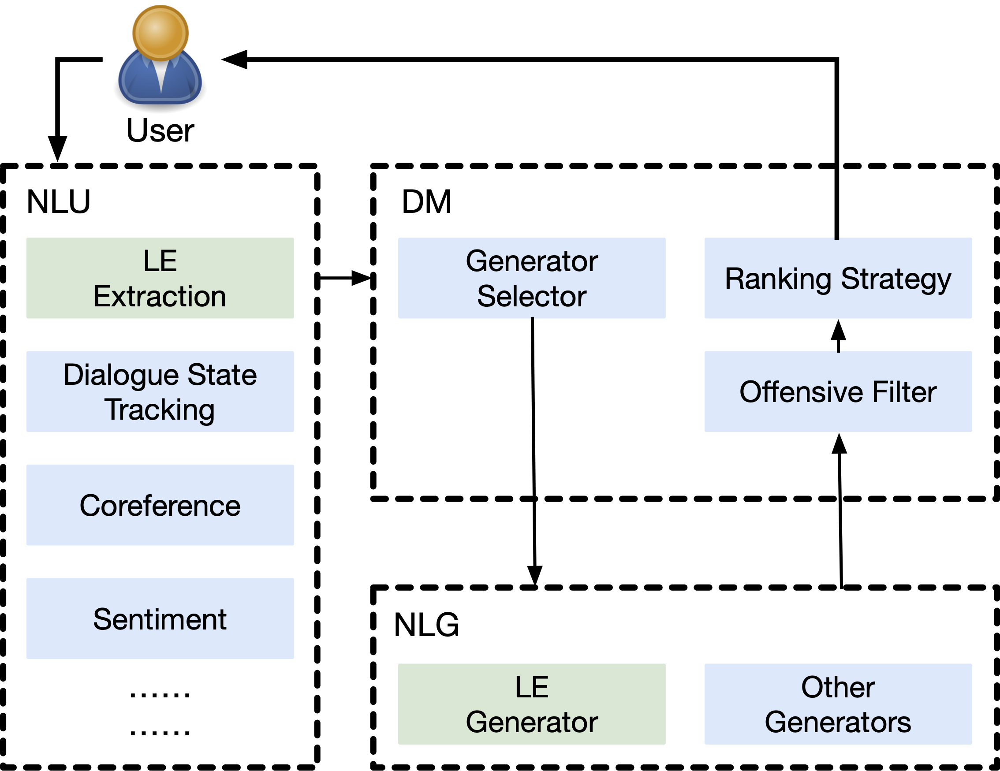

# Lexical Entrianment for Conversation Systems
This repository provides the code for the Findings of EMNLP 2023 paper titled **[Lexical Entrianment for Conversation Systems]()**, making the integration of our code contributions into other projects more accessible.

<div align="center">

  []()
  [](https://pytorch.org/)
  [](https://opensource.org/licenses/MIT)
</div>


<p align="center">
  </a>
  <br />
</p>

## Quick Links
- [Lexical Entrianment for Conversation Systems](#lexical-entrianment-for-conversation-systems)
  - [Quick Links](#quick-links)
  - [Overview](#overview)
  - [1. Requirements](#1-requirements)
  - [2. MultiWOZ-ENTR datasets](#2-multiwoz-entr-datasets)
  - [Bugs or questions?](#bugs-or-questions)
  - [Citation](#citation)

## Overview
You can reproduce the experiments of our paper [Lexical Entrianment for Conversation Systems]().

> **Abstract**
>
> Conversational agents have become ubiquitous in assisting with daily tasks, and are expected to possess human-like features. One such feature is lexical entrainment (LE), a phenomenon in which speakers in human-human conversations tend to naturally and subconsciously align their lexical choices with those of their interlocutors, leading to more successful and engaging conversations. As an example, if a digital assistant replies “Your appointment for Jinling Noodle Pub is at 7 pm” to the question “When is my reservation for Jinling Noodle Bar today?”, it may feel as though the assistant is trying to correct the speaker, whereas a response of “Your reservation for Jinling Noodle Bar is at 7 pm” would likely be perceived as more positive. This highlights the importance of LE in establishing a shared terminology for maximum clarity and reducing ambiguity in conversations. However, we demonstrate in this work that current response generation models do not adequately address this crucial humanlike phenomenon. To address this, we propose a new dataset, named MULTIWOZ-ENTR, and a measure for LE for conversational systems. Additionally, we suggest a way to explicitly integrate LE into conversational systems with two new tasks, a LE extraction task and a LE generation task. We also present two baseline approaches for the LE extraction task, which aim to detect LE expressions from dialogue contexts.

## 1. Requirements
```
python
torch
nltk
```

## 2. MultiWOZ-ENTR datasets
Please refer to the folder `MultiWOZ-ENTR` for the details of the dataset.

## Bugs or questions?
If you have any questions regarding the code or the paper, please feel free to reach out to Zhengxiang at `zhengxiang.shi.19@ucl.ac.uk`.  If you experience any difficulties while using the code or need to report a bug, feel free to open an issue. We kindly ask that you provide detailed information about the problem to help us provide effective support.


## Citation
```
@inproceedings{shi-etal-2023-lexical,
title={Lexical Entrianment for Conversation Systems},
author={Shi, Zhengxiang and Sen, Procheta and Lipani, Aldo},
booktitle={Findings of the Association for Computational Linguistics: EMNLP 2023},
year={2023},
publisher={Association for Computational Linguistics}
}
```
